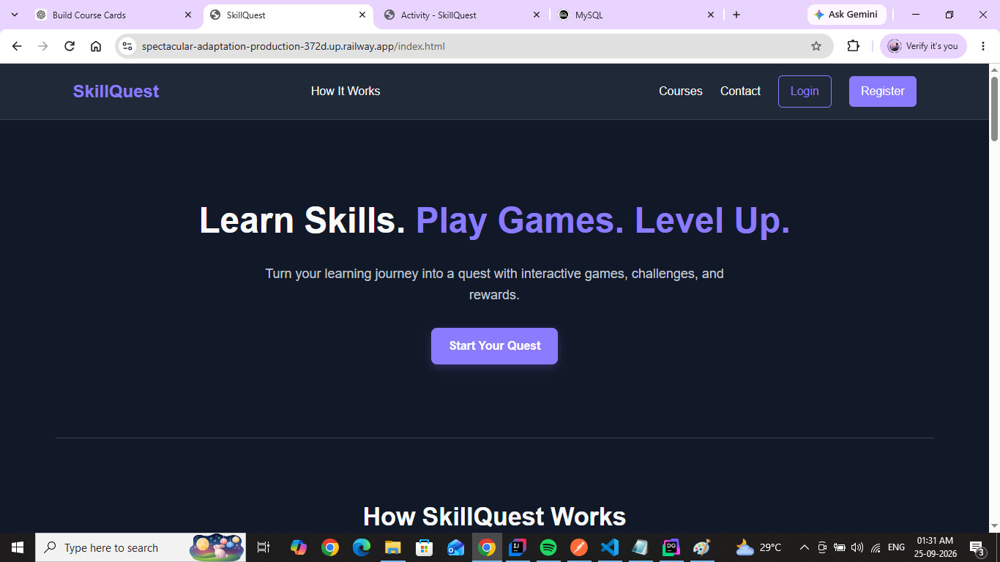
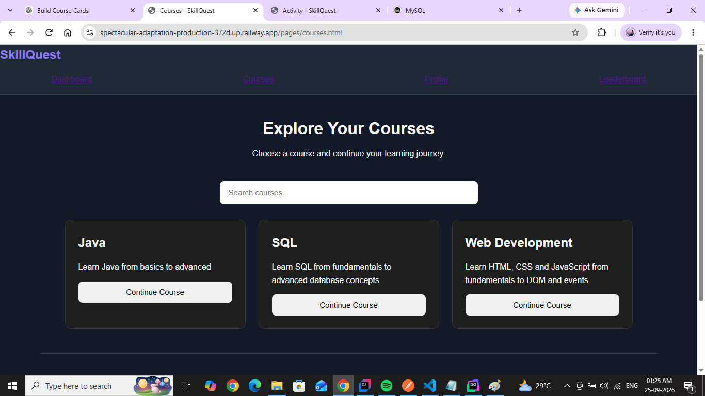
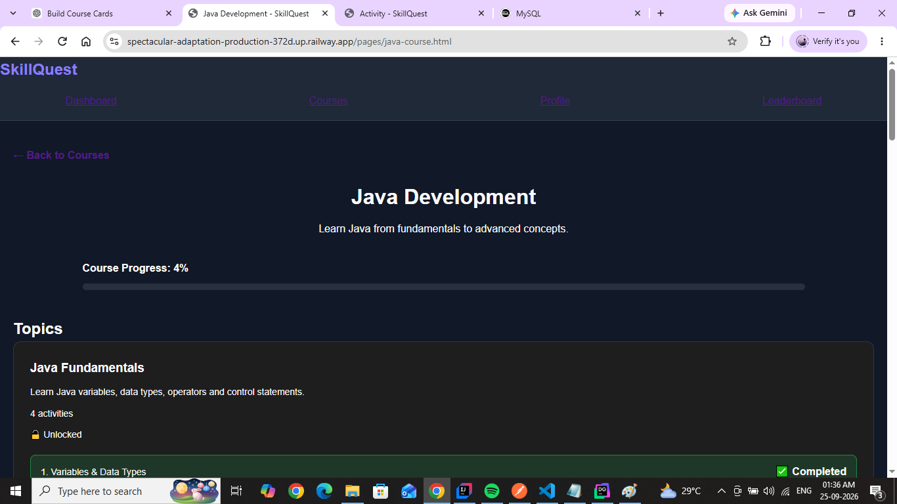
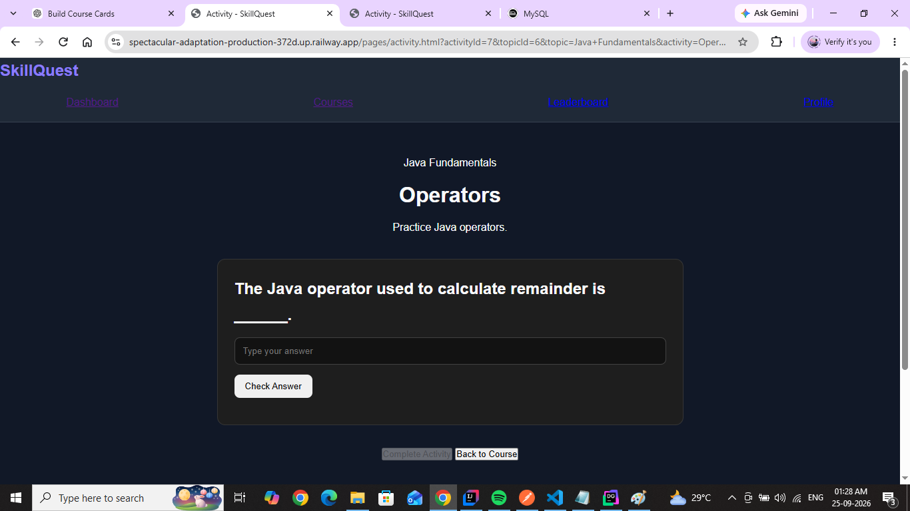
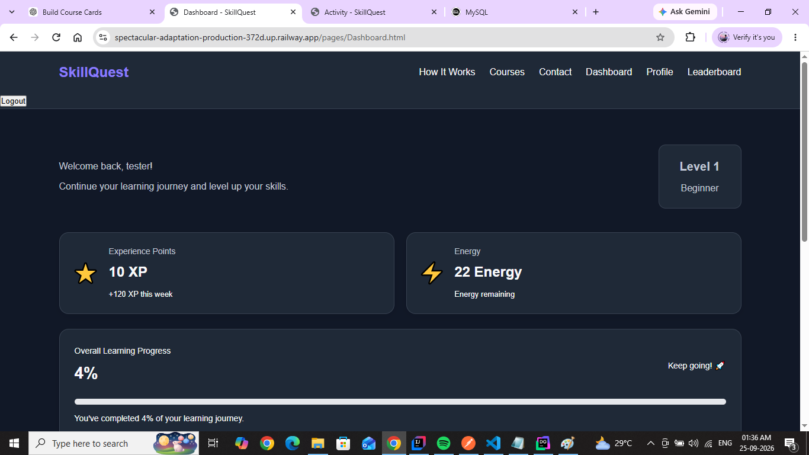

# SkillQuest - Game & Learn Platform

SkillQuest is a full-stack gamified learning platform designed to make technical learning more interactive and engaging.

Users can register, log in, explore courses, complete game-based learning activities, track their progress, earn XP and points, unlock topics, achieve milestones, take programming assessments, and compete through course leaderboards.

The project was built from scratch using a vanilla HTML/CSS/JavaScript frontend and a Spring Boot REST API backend secured with JWT authentication.

## Live Demo

**SkillQuest:**  
https://spectacular-adaptation-production-372d.up.railway.app

> Create an account through the Register page to explore the application.

## Features

### Authentication & Security
- User registration and login
- JWT-based authentication
- BCrypt password hashing
- Role-based authorization with USER and ADMIN roles
- Protected backend endpoints
- Restricted administrative operations

### Courses & Learning
- Java, SQL, and Web Development courses
- Topic-based course structure
- Multiple activities within each topic
- Activity-by-activity progression
- Locked and unlocked learning progression
- Automatic course progress tracking

### Interactive Activities
SkillQuest supports multiple activity types:

- Quiz
- Fill in the Blank
- Matching
- True / False
- Code Output
- Debugging
- Code Ordering
- Code Challenge

Answers are validated by the backend so correct answers are not exposed to the frontend before submission.

### Gamification
- XP system
- Points system
- Energy system
- Course progress tracking
- Topic and activity completion
- Milestone badges
- Course leaderboards
- Automatic leaderboard ranking

### Programming Assessment
- Programming assessment unlocked at the required course milestone
- Assessment submission and scoring
- Pass/fail result handling
- Assessment attempt tracking

### Dashboard
Users can view:

- Course progress
- Overall learning progress
- XP
- Points
- Energy
- Learning statistics

### User Profile
- User profile information
- Learning statistics
- Dark-themed interface
- Application preferences

### Admin Features
Administrators can manage:

- Users
- Courses
- Topics
- Activities
- Activity questions
- Learning content
- User restrictions

## Tech Stack

### Frontend
- HTML5
- CSS3
- JavaScript
- Fetch API
- Local Storage

### Backend
- Java
- Spring Boot
- Spring MVC
- Spring Data JPA
- Hibernate
- Spring Security
- JWT Authentication
- BCrypt
- Maven

### Database
- MySQL

### Development & Testing Tools
- IntelliJ IDEA
- Visual Studio Code
- DataGrip
- Postman
- Git
- GitHub

### Deployment
- Railway
- Docker
- Nginx

## Project Architecture

SkillQuest follows a layered backend architecture:

```text
Controller
    |
Service
    |
Repository
    |
Database
```

DTOs are used between API layers to control request and response data.

The backend is organized into:

```text
config/
controller/
dto/
entity/
exception/
repository/
security/
service/
```

## Project Structure

```text
SkillQuest-game-and-learn-platform/
|
|-- SkillQuest Frontend/
|   |-- assets/
|   |-- css/
|   |-- js/
|   |-- pages/
|   |-- index.html
|   `-- Dockerfile
|
|-- SkillQuest Backend/
|   |-- src/main/java/com/rudhraa/skillquest/
|   |   |-- config/
|   |   |-- controller/
|   |   |-- dto/
|   |   |-- entity/
|   |   |-- exception/
|   |   |-- repository/
|   |   |-- security/
|   |   `-- service/
|   |
|   |-- src/main/resources/
|   |   `-- application.yaml
|   |
|   |-- pom.xml
|   `-- Dockerfile
|
`-- README.md
```

## REST API

The backend provides REST APIs for:

- Authentication
- Users
- Courses
- Topics
- Activities
- Activity questions
- Progress tracking
- Game statistics
- Badges
- Leaderboards
- Programming assessments

Example endpoints:

```text
POST /api/users/register
POST /api/auth/login

GET  /api/courses
GET  /api/topics/course/{courseId}

GET  /api/activity-questions/public/activity/{activityId}
POST /api/activity-questions/validate

GET  /api/users/me
```

Administrative create, update, and delete operations are protected using role-based authorization.

## Security

SkillQuest uses Spring Security and JWT authentication.

After successful login, the backend generates a JWT token. The frontend sends this token with protected API requests.

Passwords are stored using BCrypt hashing.

Sensitive production configuration is supplied using environment variables rather than being committed to the repository:

```text
DB_PASSWORD
JWT_SECRET
```

Public activity-question responses do not expose correct answers. User answers are submitted to the backend for validation.

## Running the Project Locally

### Requirements

Install:

- Java
- Maven
- MySQL
- A modern web browser

### 1. Clone the Repository

```bash
git clone https://github.com/rudhraa-viswanathan/SkillQuest-game-and-learn-platform.git
cd SkillQuest-game-and-learn-platform
```

### 2. Create the Database

Create a MySQL database:

```sql
CREATE DATABASE skillquest_db;
```

### 3. Configure Backend Environment Variables

Configure the following environment variables:

```text
DB_PASSWORD=your_mysql_password
JWT_SECRET=your_secure_jwt_secret
```

The default local database configuration expects:

```text
jdbc:mysql://localhost:3306/skillquest_db
username: root
```

### 4. Run the Backend

```bash
cd "SkillQuest Backend"
./mvnw spring-boot:run
```

On Windows:

```powershell
.\mvnw.cmd spring-boot:run
```

The backend runs locally on:

```text
http://localhost:8080
```

### 5. Run the Frontend

Open the frontend using a local web server such as VS Code Live Server.

Example:

```text
http://127.0.0.1:5500
```

## Production Deployment

The application is deployed on Railway.

The frontend is served through Nginx inside a Docker container, while the Spring Boot backend and MySQL database run as separate production services.

Production credentials and secrets are configured using Railway environment variables.

## Current Learning Content

The deployed learning platform contains:

- 3 courses
- 18 topics
- 81 activities
- 414 activity questions

## Screenshots

### Landing Page


### Courses


### Java Course


### Interactive Activity


### Dashboard



## What I Learned

Building SkillQuest helped me gain practical experience with:

- Designing a full-stack application from scratch
- Building RESTful APIs with Spring Boot
- Designing layered backend architecture
- Working with JPA and Hibernate
- Designing relational database entities
- Implementing DTO-based API communication
- Implementing JWT authentication and authorization
- Securing endpoints with Spring Security
- Validating data on the backend
- Handling exceptions globally
- Integrating frontend JavaScript with REST APIs
- Managing application state and progress
- Implementing gamification logic
- Deploying a full-stack application with Docker and Railway
- Managing production environment variables and databases
- Using Git and GitHub throughout the development process

## Author

**Rudhraa Viswanathan**

GitHub: [rudhraa-viswanathan](https://github.com/rudhraa-viswanathan)